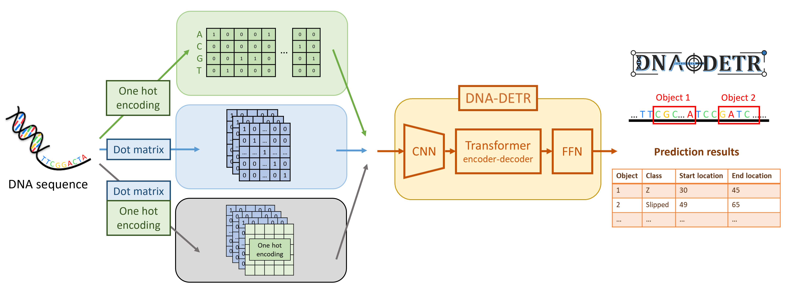

 


---------------------------------------
# DNA-DETR: Sequence representation matters in object detection for functional genomic elements

DNA-DETR, an adaptation of the DETR architecture for object detection in genomic sequences, using Non-B DNA motifs as benchmarks. Our study reveals that conventional one-hot encoding inadequately captures complex sequence features. By comparing one-hot, dot matrix, and hybrid representations, we show that representation choice significantly impacts detection accuracy and generalization. Combined representations consistently improve both localization and classification of functional genomic elements, highlighting the importance of representation-aware modeling in sequence analysis.

## Method
 

## Install

```sh
git clone https://github.com/brent88310070/DNA-DETR.git
cd DNA-DETR
conda env create -f environment.yml
conda activate dnadetr
```


## Quick start

### Data pre-processing
Pre-process the dataset of DNA-DETR \
* You need to divide the training & testing seq datatets first, and execute script separately.
* There are three types of features: `one-hot`, `dot`, `both`
* The label datasets format is illustrated in the [Link](./label_format.md) & [Label example](./label_example.json).
```Python
python seq2feature.py \
    --fasta data/your_data.fasta \
    --feature both \
    --out-prefix data/train_features \
    --n-proc 8
```

### DNA-DETR
Train a DNA-DETR model based on your Non-B DNA data
```Python
nohup python -u main.py \
      --epochs 50 \
      --batch_size 128 \
      --num_queries 30 \
      --data_num_class 6 \
      --feature_type both \
      --data_path ./data/both/ \
      --output_dir ./output > train.out &
```

Evaluate Non-B DNA data based on DNA-DETR model
```Python
nohup python -u main.py \
      --batch_size 2 \
      --eval \
      --resume ./output/your_checkpoint.pth \
      --output_dir ./output > eval.out &
```

---
## Advanced usage
<details> <summary>Data pre-processing</summary>
  <pre><code>usage: seq2feature [-h] --fasta FASTA [--kmer KMER]
                    [--base-height BASE_HEIGHT]
                    [--feature {dot,one-hot,both}]
                    [--out-prefix OUT_PREFIX]
                    [--n-proc N_PROC, --max-workers N_PROC]

  </n>
optional arguments:
  -h, --help            show this help message and exit
  --fasta FASTA         Input FASTA file (required)
  --kmer KMER           Consecutive match length (k-mer length) [default: 3]
  --base-height BASE_HEIGHT
                        Rows per nucleotide in one-hot encoding [default: 1]
  --feature {dot,one-hot,both}
                        Which feature(s) to compute [default: both]
  --out-prefix OUT_PREFIX
                        Output prefix (no extension) [default: features]
  --n-proc N_PROC, --max-workers N_PROC
                        Number of CPUs / process workers [default: CPU_count]</code></pre>
</details>

<details> <summary>Train a DNA-DETR model (with important hyperparameters)</summary>
  <pre><code>usage: main.py [-h] [--lr LR] [--lr_backbone LR_BACKBONE]
               [--batch_size BATCH_SIZE] [--weight_decay WEIGHT_DECAY]
               [--epochs EPOCHS] [--lr_drop LR_DROP]
               [--clip_max_norm CLIP_MAX_NORM]
               [--backbone BACKBONE] [--dilation]
               [--position_embedding {sine,learned}]
               [--enc_layers ENC_LAYERS] [--dec_layers DEC_LAYERS]
               [--dim_feedforward DIM_FEEDFORWARD] [--hidden_dim HIDDEN_DIM]
               [--dropout DROPOUT] [--nheads NHEADS]
               [--num_queries NUM_QUERIES] [--pre_norm]
               [--no_aux_loss] [--set_cost_class SET_COST_CLASS]
               [--set_cost_diou SET_COST_DIOU]
               [--mask_loss_coef MASK_LOSS_COEF] [--dice_loss_coef DICE_LOSS_COEF]
               [--diou_loss_coef DIOU_LOSS_COEF] [--eos_coef EOS_COEF]
               [--feature_type FEATURE_TYPE] [--dataset_file DATASET_FILE]
               [--data_num_class DATA_NUM_CLASS] [--data_path DATA_PATH]
               [--output_dir OUTPUT_DIR] [--device DEVICE] [--seed SEED]
               [--resume RESUME] [--num_workers NUM_WORKERS] [--world_size WORLD_SIZE]

optional arguments:
  -h, --help            Show this help message and exit

training parameters:
  --lr LR               Learning rate [default: 1e-4]
  --lr_backbone LR_BACKBONE
                        Backbone learning rate [default: 1e-5]
  --batch_size BATCH_SIZE
                        Batch size [default: 128]
  --weight_decay WEIGHT_DECAY
                        Weight decay [default: 1e-4]
  --epochs EPOCHS       Total number of training epochs [default: 50]
  --lr_drop LR_DROP     Epoch to drop learning rate [default: 200]
  --clip_max_norm CLIP_MAX_NORM
                        Gradient clipping max norm [default: 0.1]

model parameters:
  --backbone BACKBONE   Backbone architecture [default: resnet50]
  --dilation            Use dilated convolutions (DC5 mode)
  --position_embedding {sine,learned}
                        Type of positional embedding [default: sine]

transformer parameters:
  --enc_layers ENC_LAYERS
                        Number of encoder layers [default: 6]
  --dec_layers DEC_LAYERS
                        Number of decoder layers [default: 6]
  --dim_feedforward DIM_FEEDFORWARD
                        FFN hidden dimension [default: 2048]
  --hidden_dim HIDDEN_DIM
                        Transformer embedding dimension [default: 256]
  --dropout DROPOUT     Dropout rate [default: 0.1]
  --nheads NHEADS       Number of attention heads [default: 8]
  --num_queries NUM_QUERIES
                        Number of query slots [default: 30]
  --pre_norm            Enable pre-norm transformer

loss parameters:
  --no_aux_loss         Disable auxiliary losses
  --set_cost_class SET_COST_CLASS
                        Classification cost in Hungarian matching [default: 1]
  --set_cost_diou SET_COST_DIOU
                        DIoU box cost in Hungarian matching [default: 2]
  --mask_loss_coef MASK_LOSS_COEF
                        Mask loss coefficient [default: 1]
  --dice_loss_coef DICE_LOSS_COEF
                        DICE loss coefficient [default: 1]
  --diou_loss_coef DIOU_LOSS_COEF
                        DIoU loss coefficient [default: 2]
  --eos_coef EOS_COEF   No-object class weight [default: 0.05]

dataset parameters:
  --feature_type FEATURE_TYPE
                        Feature type: one-hot | dot | both [default: both]
  --dataset_file DATASET_FILE
                        Dataset name key [default: nonb]
  --data_num_class DATA_NUM_CLASS
                        Number of classes (max_obj_id + 1) [default: 6]
  --data_path DATA_PATH
                        Dataset path [default: ./data/both/]

runtime and I/O:
  --output_dir OUTPUT_DIR
                        Output directory [default: ./output]
  --device DEVICE       Device for training/testing [default: cuda]
  --seed SEED           Random seed [default: 0]
  --resume RESUME       Resume from checkpoint path
  --start_epoch START_EPOCH
                        Starting epoch [default: 0]</code></pre>

Loss write to TensorBoard for visualization:
<pre><code>tensorboard --logdir ./runs --port 8000</code></pre>
</details>

<details> <summary>Evaluate Non-B DNA by DNA-DETR model (with important hyperparameters)</summary>
  <pre><code>usage: main.py [-h]
               [--feature_type FEATURE_TYPE]
               [--dataset_file DATASET_FILE]
               [--data_num_class DATA_NUM_CLASS]
               [--data_path DATA_PATH] [--remove_difficult]
               [--output_dir OUTPUT_DIR] [--device DEVICE] [--seed SEED]
               [--resume RESUME] [--start_epoch START_EPOCH] [--eval]
               [--num_workers NUM_WORKERS]

optional arguments:
  -h, --help            Show this help message and exit

dataset parameters:
  --feature_type FEATURE_TYPE
                        Feature type: one-hot | dot | both [default: both]
  --dataset_file DATASET_FILE
                        Dataset name key [default: nonb]
  --data_num_class DATA_NUM_CLASS
                        Number of classes (max_obj_id + 1) [default: 6]
  --data_path DATA_PATH
                        Dataset path [default: ./data/both/]

runtime and I/O:
  --output_dir OUTPUT_DIR
                        Output directory [default: ./output]
  --device DEVICE       Device for training/testing [default: cuda]
  --seed SEED           Random seed [default: 0]
  --resume RESUME       Resume from checkpoint path
  --eval                Run evaluation only
  --num_workers NUM_WORKERS
                        Number of dataloader workers [default: 2]</code></pre>
</details>
